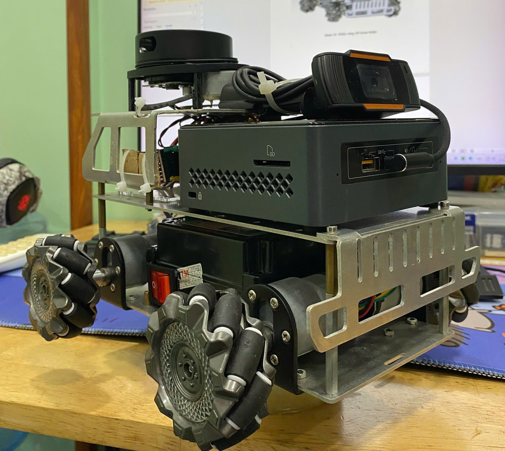

# 🤖 AuBot - Autonomous Mobile Robot Platform


**AuBot** is an omnidirectional mobile robot based on Mecanum wheels, controlled by **ROS 2 Humble** running on an **Intel NUC6CAYH** (Ubuntu Server 22.04). The vehicle is equipped with a **USB Webcam** for visual feedback and an **RPLidar A1** sensor used for Simultaneous Localization and Mapping (SLAM), autonomous navigation, obstacle avoidance, and autonomous map exploration.

## 📸 Demo & Gallery

### 🎥 Project Video


### 🤖 Real Robot


## ⚙️ Hardware Specifications

The robot is built upon a custom hardware architecture focusing on modularity and performance:

| Component | Model / Specs | Function |
| :--- | :--- | :--- |
| **Main Computer** | **Intel NUC6CAYH** | Runs Ubuntu 22.04, ROS 2, AI Processing, and Web Server. |
| **Microcontroller** | **STM32F411CEU6** | Handles PID control for motors and reads encoder data. |
| **Lidar Sensor** | **RPLidar A1M8** | 360° laser scanner for SLAM (Mapping) and Obstacle Avoidance. |
| **Visual Sensor** | **USB Webcam** | Provides video stream for remote monitoring and YOLOv8 object detection. |
| **Drive System** | **4x Mecanum Wheels** | Enables omnidirectional movement (Holonomic drive). |
| **Actuators** | **4x JGB37 Motors** | DC Geared motors with integrated magnetic encoders. |
| **Motor Drivers** | **2x TB6612FNG** | Dual H-Bridge driver for controlling 4 motors via PWM. |

## 🚀 Key Features

* **Autonomous Navigation:** Path planning using Nav2 stack and SLAM Toolbox.
* **Map Exploration:** Automatically explores unknown environments (`explore_lite` / `m-explore`).
* **AI Perception:** Real-time object detection and following using YOLOv8.
* **Web Interface:** A modern ReactJS dashboard for map visualization and teleoperation.
* **Voice Command:** Integrated voice recognition for basic robot control.

## 🛠️ System Architecture

* **High-Level:** The Intel NUC handles heavy tasks like path planning (Nav2), mapping, and Computer Vision.
* **Low-Level:** The STM32 communicates with the NUC via Serial (UART) to execute velocity commands (`cmd_vel`) and publish odometry data.
* **User Interface:** A ReactJS web dashboard connects to the robot via WebSocket (`rosbridge`) for real-time control.

## ⚙️ Installation & Setup

### 1. Prerequisites
* **OS:** Ubuntu 22.04 LTS (Desktop/Server)
* **ROS:** ROS 2 Humble Hawksbill

### 2. Environment Setup

**Step 1: Install Python Dependencies**
```bash
pip install -r requirements.txt
```

**Step 2: Build ROS 2 Workspace**
```bash
cd ros2_ws
rosdep update
rosdep install --from-paths src --ignore-src -r -y
colcon build --symlink-install
source install/setup.bash
```

**Step 3: Setup Web Interface**
```bash
cd web_interface
npm install
```

## 🎮 Usage
**Launch Robot Core (ROS 2)**
```bash
cd ros2_ws
source install/setup.bash
ros2 launch my_robot_description navigation_launch.py || ros2 launch my_robot_description exploration_launch.py
```

**Start Web Dashboard**
```bash
cd web_interface
npm run dev
```

**Start AI Perception (YOLOv8)**
```bash
python3 web_interface/ai_server.py
```

**Voice Control**
```bash
cd ros2_ws
source install/setup.bash
ros2 run voice_control voice_node
```

## 🗺️ SLAM & Navigation Modes
To save a new map:
```bash
ros2 run nav2_map_server map_saver_cli -f my_map
```
